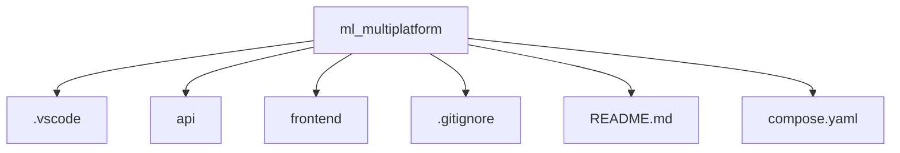
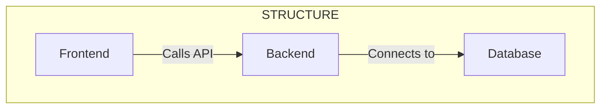

```mermaid
graph TD;
    A[ml_multiplatform]
    A --> B[.vscode]
    A --> C[api]
    A --> D[frontend]
    A --> E[.gitignore]
    A --> F[README.md]
    A --> G[compose.yaml]
```

```mermaid
graph TD;
    A[Frontend] -- Calls API --> B[Backend]
    B -- Connects to --> C[Database]
    subgraph STRUCTURE
        A
        B
        C
    end
```
