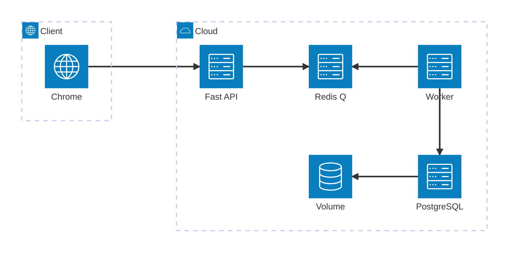
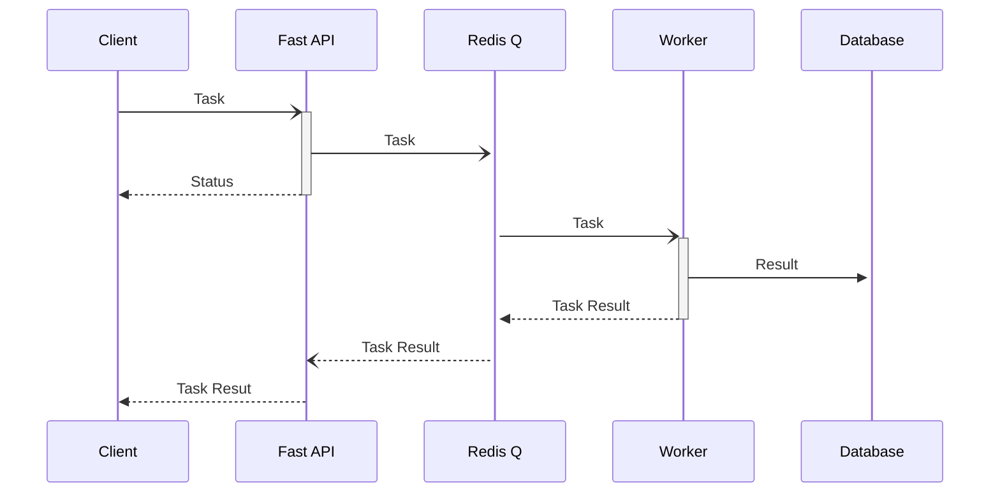

# Platfrom Arcitecture

### General overview

```mermaid
architecture-beta
    %% Cloud side
    group cloud(cloud)[Cloud]

    service db(server)[PostgreSQL] in cloud
    service worker(server)[Worker] in cloud
    service api(server) [Fast API] in cloud
    service queue(server) [Redis Q] in cloud
    service volume(database) [Volume] in cloud

    api:R --> L:queue
    worker:L --> R:queue
    worker:B --> T:db
    db:L --> R:volume
    
    %% Client side
    group client(internet) [Client]

    service browser(internet) [Chrome] in client

    browser:R --> L:api
```

### Tasks flow

```mermaid
sequenceDiagram
    Client-)+Fast API: Task
    Fast API-)+Redis Q: Task
    Fast API-->>-Client: Status
    Redis Q-)+Worker: Task
    Worker->>+Database: Result
    Worker-->>-Redis Q: Task Result
    Redis Q--)Fast API: Task Result
    Fast API-->>Client: Task Resut
```
